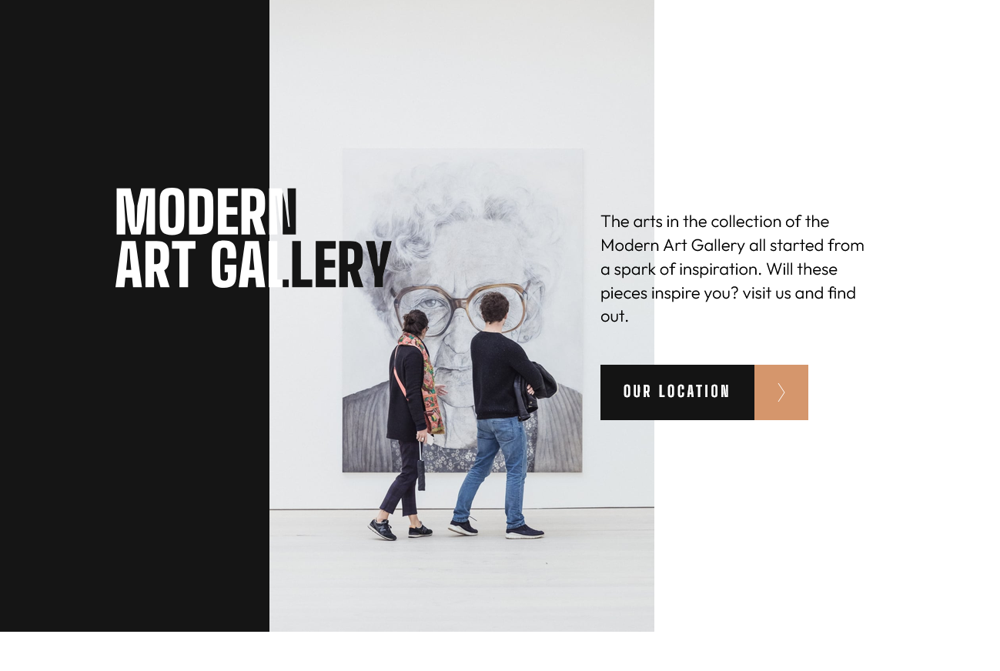

# Frontend Mentor - Art gallery website solution

This is a solution to the [Art gallery website challenge on Frontend Mentor](https://www.frontendmentor.io/challenges/art-gallery-website-yVdrZlxyA). Frontend Mentor challenges help you improve your coding skills by building realistic projects.

## Overview

### The challenge

Users should be able to:

- View the optimal layout for each page depending on their device's screen size
- See hover states for all interactive elements throughout the site
- **Bonus**: Use [Leaflet JS](https://leafletjs.com/) to create an interactive location map with custom location pin

### Screenshot

### Links

- Solution URL: https://github.com/cgojk/artgallery.git
- Live Site URL: https://artgallerycataling.netlify.app/

## My process

### Built with

- Semantic HTML5 markup
- CSS custom properties
- Flexbox
- CSS Grid
- Mobile-first workflow
- [React](https://reactjs.org/) - JS library
- [Styled Components](https://styled-components.com/) - For styles

### What I learned

I continue learning about and building reusable components. In this case the link button component that I could use across the Home and Our Location pages. Instead of creating the button again for each page, I used a variant to change the content and the arrow depending on where the component was being used.

It took me a while to figure out how to put together the light and dark parts of the title in the hero section. I finally decided to use clip-path, although I am still not 100% sure if it is the best approach. It was tricky to get the clipping effect working and to make it look as close as possible to the design.

For the hero layout, I also used CSS Grid instead of relying heavily on position: absolute and position: relative. I initially tried using positioning, but it took me a long time to make it work correctly. In the end, I think CSS Grid was a better approach because it simplified the layout and helped me avoid having to add too much code for different breakpoints.

One of the main areas I still need more practice with is making image containers work consistently across different breakpoints while maintaining their proportions. I also tried to avoid relying heavily on position: absolute and position: relative where possible.

Another area I identified for improvement is the way I handled spacing and padding. At the moment, some elements have individual padding values for different breakpoints. This means that if I need to make a design change in the future, I have to find and update the padding for each individual element.

A better approach would be to use clamp() for responsive spacing and potentially create CSS variables for the main padding values. This would make the layout easier to maintain and allow me to make global changes more efficiently.

Overall, I think the two pages are manageable, and I am happy with what I have achieved. I have learned a lot about reusable components, responsive layouts, CSS Grid, clip-path, viewport units, and responsive spacing. There are still areas I need to practise, particularly responsive image containers and maintaining proportions across different breakpoints. However, I now have a better understanding of where I can improve my approach and how to make my code more maintainable in future projects.

## Author

Catalina G.

## Acknowledgments

This is where you can give a hat tip to anyone who helped you out on this project. Perhaps you worked in a team or got some inspiration from someone else's solution. This is the perfect place to give them some credit.

**Note: Delete this note and edit this section's content as necessary. If you completed this challenge by yourself, feel free to delete this section entirely.**
